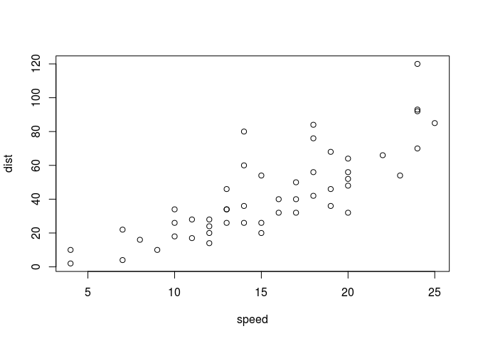

<!-- README.md is generated from README.Rmd. Please edit that file -->
[](http://cran.r-project.org/package=captioner)

Status
======

*captioner* is no longer under development as the functionality has been replaced with the new package [bookdown](https://github.com/rstudio/bookdown). Thank you to everyone who used and contributed!

Overview
========

*captioner* is an R package for generating figure numbers and captions

Information about recent updates can be found in [NEWS.md](https://github.com/adletaw/captioner/blob/master/NEWS.md).

Installation
============

*captioner* is now available on [CRAN](https://cran.r-project.org/web/packages/captioner/index.html). If you would like to install the current development version:

-   `install.packages("devtools")`
-   `devtools::install_github("adletaw/captioner")`

or if you want the vignette:

-   `devtools::install_github("adletaw/captioner", build_vignettes = TRUE)`
-   `vignette("using_captioner")`

Basic Usage
===========

A call to the function `captioner()` returns a captioner function for each set of figures, tables, etc. that you want to create.

You can generate a full caption:

``` r
fig_nums <- captioner()
fig_nums("my_first_figure", "My first figure's caption.")
#> [1] "Figure 1: My first figure's caption."
```

And display it under your plot using inline code chunks:

``` r
plot(cars)
```

<!-- -->

Figure 1: My first figure's caption.

Once you have created the caption, you can display it by using your function and specifying the name of the caption you created.

``` r
fig_nums("my_first_figure")
#> [1] "Figure 1: My first figure's caption."
```

The `display` parameter allows you to adjust how much of the caption is displayed. For example, you can also generate a figure reference:

``` r
fig_nums("my_first_figure", display = "cite")
#> [1] "Figure 1"
```

Which can be displayed inline using inline code chunks, like so (Figure 1).

Each new call to your captioner function will create a caption with an incremented number. For example:

``` r
fig_nums("my_second_figure", "The caption for my second figure.")
#> [1] "Figure 2: The caption for my second figure."
```

If you need to create a new set of captions with new numbering, for example, for your tables, simply make a new call to the `captioner` function. Using the `prefix` parameter allows you to specify the prefix associated with your new captions:

``` r
table_nums <- captioner(prefix = "Table")
table_nums("cat_table", "A table of cat breeds.")
#> [1] "Table 1: A table of cat breeds."
```

| Breed      | Coat      |
|------------|-----------|
| Abyssinian | Short     |
| Aegean     | Semi-Long |
| Persian    | Long      |

Table 1: A table of cat breeds.

One way to make in-text citations easier is by using `partial`<sup>1</sup> from the package [pryr](https://github.com/hadley/pryr) to create a shorter version of the function. For example:

``` r
citef <- pryr::partial(fig_nums, display = "cite")
citef("my_second_figure")
#> [1] "Figure 2"
```

Take a look at the [vignette](https://github.com/adletaw/captioner/tree/master/vignettes/using_captioner.Rmd) for many more details.

------------------------------------------------------------------------

1.  I learned this from the glorious H Wickham and [you can too](http://adv-r.had.co.nz/)
